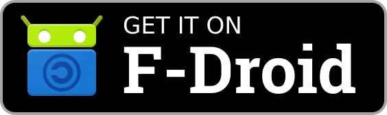
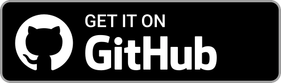
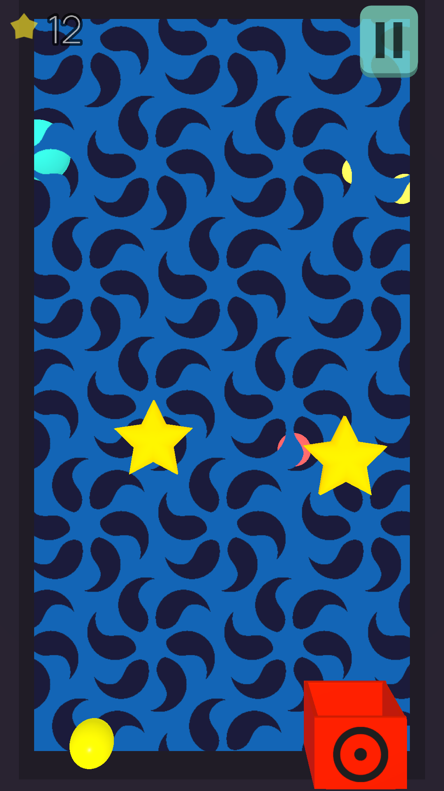
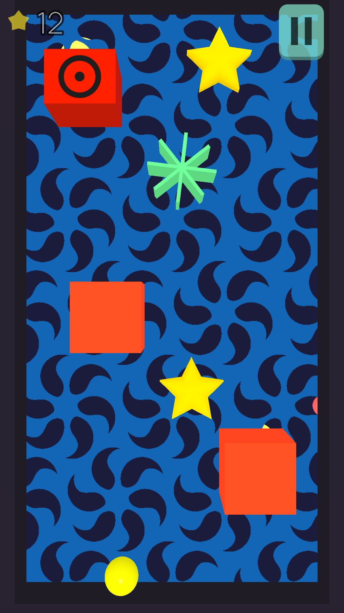
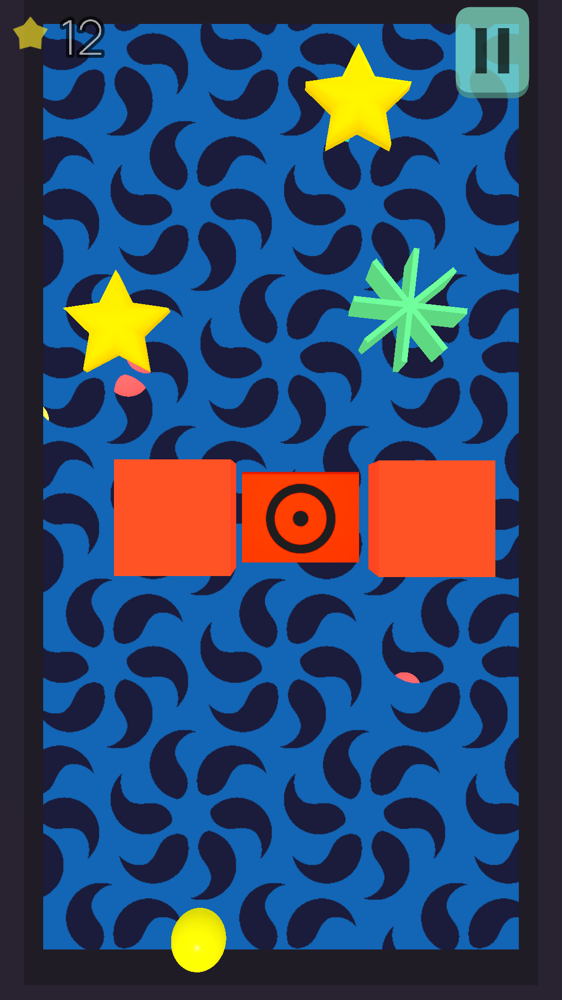
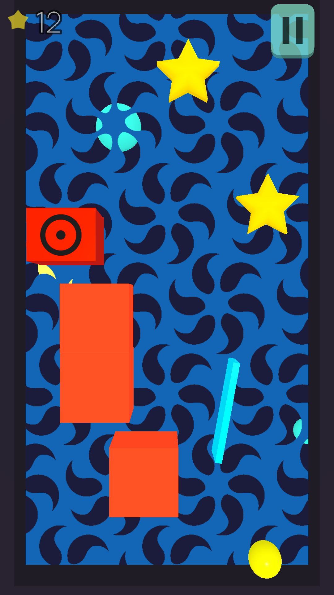

# Ball2Box
[](https://github.com/dulvui/ball2box/actions/workflows/upload-android.yml)
[](https://github.com/dulvui/ball2box/actions/workflows/upload-ios.yml)  

Swipe to toss the ball and hit the box in over 100 levels.
This game is open source, with no ads and no tracking.  

Made with [Godot Engine](https://godotengine.org) version 3.5.2  
Track the migration to Godot 4.x in [issue #6](https://github.com/dulvui/ball2box/issues/6)  

<a href="https://play.google.com/store/apps/details?id=com.salvai.ultimatetoss" target="_blank"></a>
<a href="https://apps.apple.com/us/app/ball2box/id1522604143" target="_blank"></a>
<a href="https://f-droid.org/en/packages/com.simondalvai.ball2box/" target="_blank"></a>
<a href="https://github.com/dulvui/ball2box/releases/" target="_blank"></a>

## Table of contents
- [Ball2Box](#ball2box)
  - [Table of contents](#table-of-contents)
  - [Screenshots](#screenshots)
  - [Setup](#setup)
  - [Contributions](#contributions)
  - [Licenses](#licenses)
  - [Third party assets](#third-party-assets)
    - [Audio](#audio)
    - [2D assets](#2d-assets)
    - [3D assets](#3d-assets)
    - [Font](#font)

## Screenshots
<div>
  
  
  
  
</div>

## Setup
Get the latest version of the Godot Engine editor and check out the  
repo. Then open the `game/project.godot` file with the editor.

For further instructions, like exporting to mobile, please read the official [Godot Docs](https://docs.godotengine.org/en/stable/).

## Contributions
If you want to contribute to the project, please fork the repo,    
make your changes and make a pull request with a short description  
of the changes you made.

## Licenses
The game itself is licensed under the [GNU AGPL v3.0](LICENSE) license and all  
assets made by myself are licensed under the [CC-BY-SA-4.0](https://creativecommons.org/licenses/by-sa/4.0/) license.


## Third party assets

### Audio

"The heist" Royalty-Free Music by https://audiohub.com is licensed under [CC-BY-4.0](https://creativecommons.org/licenses/by/4.0/)
```
game/assets/audio/heist.ogg
```

"Snares and Crash" by LMMS (https://github.com/LMMS/assets) are licensed under [CC0-1.0](https://creativecommons.org/publicdomain/zero/1.0/)
```
game/assets/audio/snare05.ogg
game/assets/audio/snare02.ogg
game/assets/audio/crash02.ogg
```
### 2D assets


"Game Icons" by kenney.nl (https://www.kenney.nl/assets/game-icons) are licensed under [CC0-1.0](https://creativecommons.org/publicdomain/zero/1.0/)
```
game/assets/star.png
game/assets/right.png
game/assets/musicOn.png
game/assets/musicOff.png
game/assets/left.png
game/assets/audioOn.png
game/assets/audioOff.png
game/assets/arrowDown.png
game/assets/information.png
game/assets/pointer.png
```

### 3D assets
"Star" by Savino (https://opengameart.org/content/star-0) is licensed under [CC0-1.0](https://creativecommons.org/publicdomain/zero/1.0/)
```
game/assets/obj/star.obj
```

"Volleyball" by PatelDev (https://skfb.ly/6VWCM) is licensed under [CC-BY-4.0](http://creativecommons.org/licenses/by/4.0/).
```
game/assets/obj/Volleyball.obj
```

"Football" by siixarn (https://skfb.ly/KqJH) is licensed under [CC-BY-4.0](http://creativecommons.org/licenses/by/4.0/).
```
game/assets/obj/Football.blend.obj
``` 

"Octoball" by EZduzziteh (https://opengameart.org/content/some-more-wire-balls) is licensed under [CC-BY-3.0](https://creativecommons.org/licenses/by/3.0/)
```
game/assets/obj/Octoball.obj
```

### Font
"manrope.thin.otf" by sharanda (https://github.com/sharanda/manrope) is licensed under [SIL Open Font License](https://scripts.sil.org/cms/scripts/page.php?site_id=nrsi&id=OFL)
```
game/assets/font/manrope.thin.otf
```
